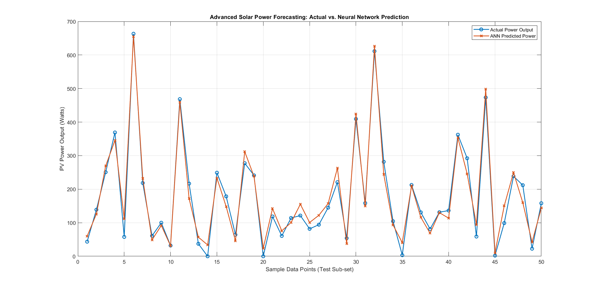

# Machine Learning-Based Solar Power Forecasting Using ANN ☀️📊

A predictive Deep Learning / Machine Learning architecture developed in MATLAB to forecast Photovoltaic (PV) power output incorporating non-linear meteorological parameters. This architecture implements a Multi-Layer Perceptron (MLP) Artificial Neural Network (ANN) trained via Levenberg-Marquardt backpropagation to optimize forecasting accuracy and minimize Mean Absolute Error (MAE) under environmental volatility constraints.

## 🚀 Project Overview
Accurate solar energy forecasting is essential for smart grid stability, energy management, and seamless Electric Vehicle (EV) grid integration. This project builds a non-linear simulation model of a PV system affected by solar irradiance, ambient temperature, and volatile cloud cover, and deploys a feedforward neural network to map these multi-dimensional environmental features to the target power output.

<p align="center">
  
</p>

## 🛠️ Features & Engineering Architecture
* **Non-Linear Data Modeling**: Simulates thermal losses and exponential cloud attenuation effects to represent true atmospheric conditions.
* **Neural Network Design**: Implements a 3-layer architecture (Input Layer -> Hidden Layer with 10 Neurons -> Output Layer) utilizing a `fitnet` structure.
* **Optimization Framework**: Employs Levenberg-Marquardt backpropagation (`trainlm`) with automated 70/15/15 data splitting for training, validation, and holdout testing.
* **Robust Evaluation**: Performance validation using Mean Absolute Error (MAE) and Coefficient of Determination (R²) metrics.

## 🧠 Neural Network Topology
The mathematical block diagram generated via MATLAB shows the detailed internal architecture of the trained model, mapping 3 input features through 10 hidden neurons using standard activation functions to evaluate the discrete power output:

<p align="center">
 
</p>

## 📊 Performance Metrics & Final Results
The core optimization routine aims to solve non-linear mapping while maintaining minimal deviation. Accuracy metrics achieved on unseen holdout test data are as follows:

* **Mean Absolute Error (MAE)**: **19.0932 Watts** (High precision localized tracking)
* **Coefficient of Determination (R²)**: **0.9754** (Explains 97.54% of non-linear data variance)

The evaluation curve below illustrates how tightly the Artificial Neural Network's predictions (Red 'X') track the actual simulated PV system output (Blue 'O') across diverse seasonal fluctuations:

<p align="center">
  
</p>

## 📁 Repository Structure
```text
├── Code/
│   ├── advanced_solar_data.mat  # Non-linear synthetic weather & PV power matrix
│   ├── generate_data.m          # Feature engineering & simulation pipeline script
│   └── main.m                   # ANN model configuration, training, and evaluation script
├── Docs/
│   └── Machine Learning-Based Non-Linear Solar Power Forecasting.docx # Project Report
├── Images/
│   └── Model of the Project.png # AI generated project model
└── Results/
    ├── ann_results.png          # Actual vs Predicted performance graph
    └── Function Fitting Neural Network (view).png # MATLAB ANN block diagram
```

## 💻 How to Execute
1. Set the MATLAB current directory to the cloned repository workspace.
2. Initialize the non-linear data pipeline:
   ```matlab
   run('Code/generate_data.m')
   ```
3. Train the neural network architecture and output performance visualization curves:
   ```matlab
   run('Code/main.m')
   ```
